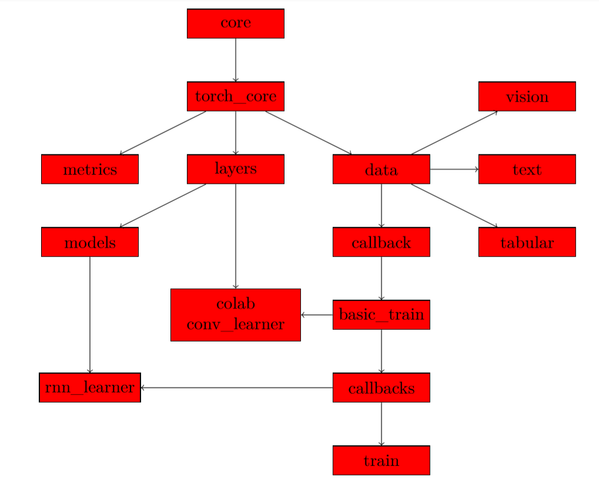

Welcome to the documenation for users of the fastai library. If you're looking for the source code, head over to the [fastai_pytorch repo](https://github.com/fastai/fastai_pytorch) on GitHub. Below is a quick overview of the key modules in this library. For details on each one, use the navigation panel to find the module you're interested in.

At the base of everything are the two modules `core` and `torch_core` (we're not including the `fastai.` prefix when naming modules in these docs). They define the basic functions we use in the library, we just split the ones that use general modules from the ones that use pytorch. We also put there all the shortcuts for type-hinting we defined (at least the one that don't depend on fastai classes defined later). Each other module usually imports `torch_core`.

Then, there are three modules directly on top of `torch_core`: 
- `data`, which contains the class that will take a `Dataset` or pytorch `DataLoader` to wrap it in a `DeviceDataLoader` (a class that sits on top of a `DataLoader` and is in charge of putting the data on the right device as well as applying transforms such as normalization) and regroup then in a `DataBunch`.
- `layers`, which contains basic functions to define custom layers or groups of layers
- `metrics`, which contains all the metrics

From `layers`, we have all the modules in the models folder that are defined. Then from `data` we can split on one of the three main types of data, which each has their own module: `vision`, `text` or `tabular`. Each of those submodules is built in the same way with:
- a submodule named `transform` that handles the transformations of our data (data augmentation for computer vision, numericalizing and tokenizing for text and preprocessing for tabular)
- a submodule named `data` that contains the class that will create datasets and the helper functions to create `DataBunch` objects.

This takes care of building your model and handling the data. We regroup those in a `Learner` object to take care of training. More specifically:
- `data` leads to the module callback where we define the basis of a callback and the `CallbackHandler`. Those are functions that will be called every step of the way of the training loop and can allow us to customize what is happening there;
- `callback` leads to `basic_train` where we define the `Learner` object, the `Recorder` (which is a callback that records stats and takes care of updating the progress bars) and have the training loop;
- `basic_train` leads to the callbacks, which are defined as modules in the `callbacks` folder;
- those callbacks are in turn imported in `learn`, where we define helper functions to invoke them.

Along the way, the module `tta` (for Test Time Augmentation) depends on `basic_train`, the module `colab` (for collaborative filtering) depends on `basic_train` and `layers`, so does the module `conv_learner` (for our models with a skeleton trained on imagenet and a custom head for classification) and the module `rnn_learn` (to automatically get learner objects for NLP) depends on `callbacks` (specifically the `rnn` callback) and `models` (specifically the rnn models).

Here is a graph of those relationships:

